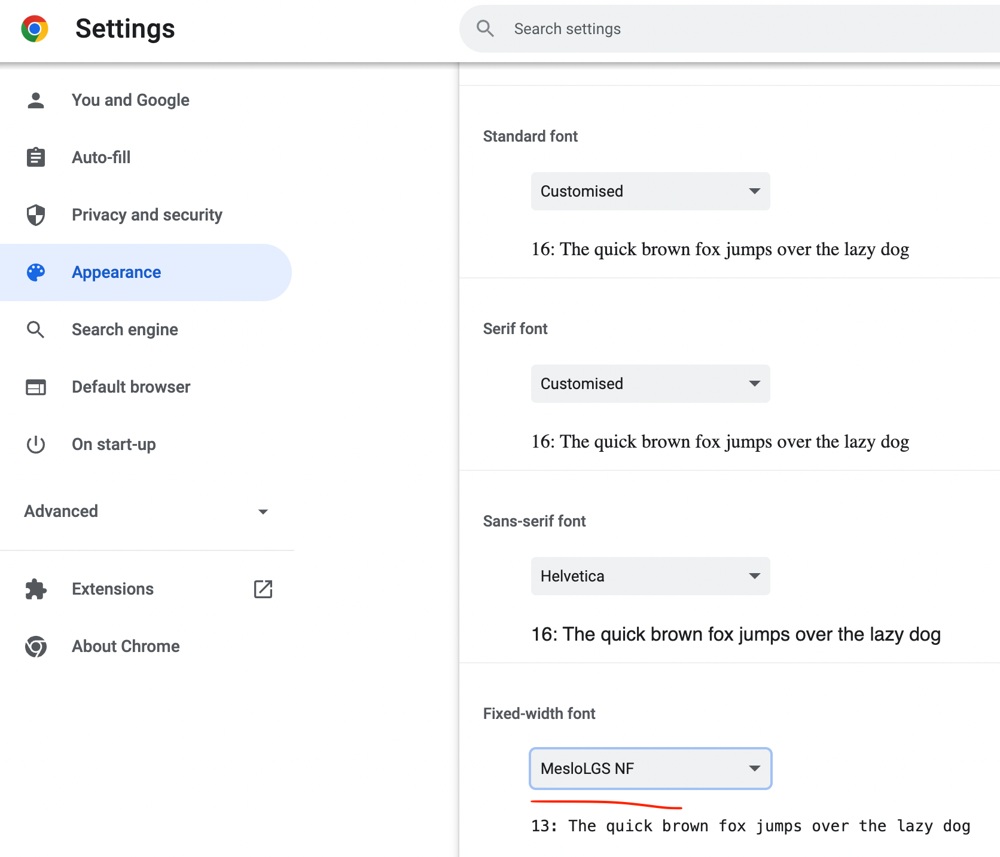
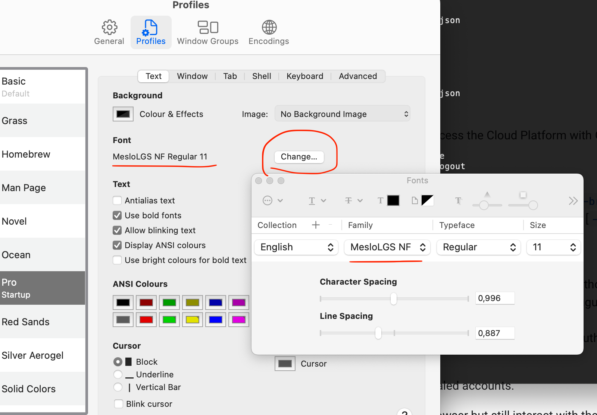
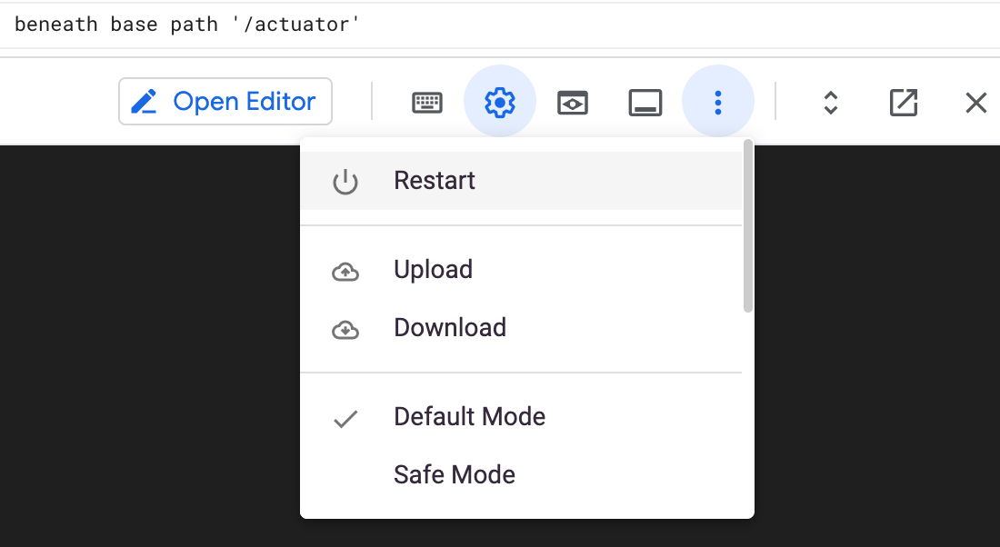
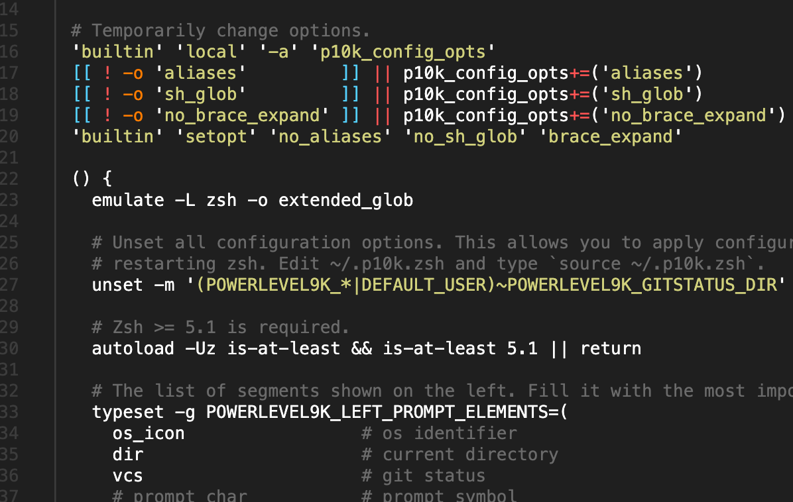

# GCP shell

Google Cloud Shell with zsh and tools. It comes with Powerline10k: https://github.com/romkatv/powerlevel10k

I am from [here on Github](https://github.com/bjblazko/gcp-shell).

## Initial installation

### Requirements

#### Font installation and setup

You will need the font _MesloLGS NF_. Download them for later installation:

* [MesloLGS NF Regular](https://github.com/romkatv/powerlevel10k-media/raw/master/MesloLGS%20NF%20Regular.ttf)
* [MesloLGS NF Bold](https://github.com/romkatv/powerlevel10k-media/raw/master/MesloLGS%20NF%20Bold.ttf)
* [MesloLGS NF Italic](https://github.com/romkatv/powerlevel10k-media/raw/master/MesloLGS%20NF%20Italic.ttf)
* [MesloLGS NF Bold Italic](https://github.com/romkatv/powerlevel10k-media/raw/master/MesloLGS%20NF%20Bold%20Italic.ttf)

Depending on your operating system, installing a font can be done with right-clicking + install
or "opening" the font file with your file manager (Finder, Explorer, Nautilus etc.).

##### Browser

When using the web browser to render your shell, ensure to set "MenloLGS NF" for monospaced
fonts. For _Chrome_, this would be:

* open Chrome
* go to settings using the three dots (or [Command]+[,] in macOS)
* open "Appearance"
* choose "Customise fonts"
* set "MenloLGS NF" for "fixed-with-font"



##### Using local terminal

In your terminal app's settings, ensure to set the monospaced font to "MesloLGS NF".
for example, with macOS' Terminal.app; do so as follows:

* open Terminal app:
  * [Command]+[Space]
  * enter "terminal"
  * enter
* open settings with [Command]+[,]
* choose "Profiles" and select your current profile
* in the font section in "Text" tab, select "Change..."
* specify "MesloLGS NF"



Then, you can ssh into your GCP shell without using a web browser:

```shell
# only once
gcloud auth login

# each time you want to SSH
gcloud cloud-shell ssh
```

This requires you to have [installed the _gcloud CLI_](https://cloud.google.com/sdk/docs/install)
and authenticated at least once: [gcloud auth login](https://cloud.google.com/sdk/gcloud/reference/auth/login).

### Installation process

In your shell, just issue

```shell
curl "https://raw.githubusercontent.com/bjblazko/gcp-shell/main/install.sh" | /bin/bash
```

and follow possible instructions as printed by the script.


## Uninstallation

In GCP shell, check for any custom files (including hidden files), since we will
erase them. If you are sure that you have no important and personal data, remove
your entire home folder:

```shell
sudo rm -rf $HOME
```

Then, restart the underlying virtual machine by clicking _More &rarr; Restart_:



More on resetting your GCP shell: https://cloud.google.com/shell/docs/resetting-cloud-shell

## Featured tools

### bat

Github: https://github.com/sharkdp/bat

Shows contents of a file, like cat, but in colours:

```shell
bat ./README.md
```



### xsv

Github: https://github.com/BurntSushi/xsv

Install: https://lindevs.com/install-xsv-on-ubuntu/

`xsv` is to CSV what XML Starlet is to XML and `jq` is to JSON.

```shell
$ curl -LO https://burntsushi.net/stuff/worldcitiespop.csv
$ xsv headers worldcitiespop.csv
1   Country
2   City
3   AccentCity
4   Region
5   Population
6   Latitude
7   Longitude
```

### gron

Github: https://github.com/tomnomnom/gron

Makes JSON greppable by flattening structures to a single line making it `grep`able :)

Take this [example JSON](https://raw.githubusercontent.com/tomnomnom/gron/master/testdata/two.json):

```json lines
{
    "name": "Tom",
    "github": "https://github.com/tomnomnom/",
    "likes": ["code", "cheese", "meat"],
    "contact": {
        "email": "mail@tomnomnom.com",
        "twitter": "@TomNomNom"
    }
}
```

issueing ```gron example.json``` produces this:

```shell
json = {};
json.contact = {};
json.contact.email = "mail@tomnomnom.com";
json.contact.twitter = "@TomNomNom";
json.github = "https://github.com/tomnomnom/";
json.likes = [];
json.likes[0] = "code";
json.likes[1] = "cheese";
json.likes[2] = "meat";
json.name = "Tom";
```

### jc

Github: https://github.com/kellyjonbrazil/jc

JSONifies output of many shell commands in order make then better
processable.